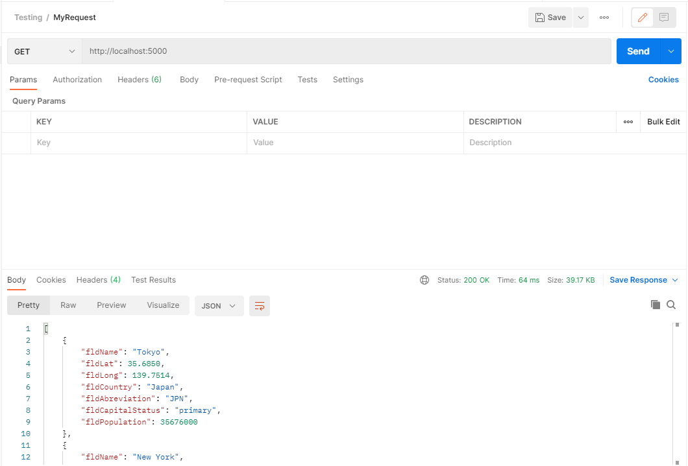

Team: Kevin Marcjanik and Luis J Mejia Garcia
Kevin: worked on the calendar
Luis: worked on the chat app

#Docker Instructions
First you will want to download docker from here: https://www.docker.com/get-started
Make sure you have Docker running, then open PyCharm.
In Pycharm you will need a Dockerfile and a docker-compose.yml file.
You can fill the files with the code on github.
In Pycharm, create a configuration using Docker compose, and select the docker-compose.yml , and make sure build and volumes are checked.
When you have the app and the configuration setup properly, just run the code, and Docker and the app should work.

#Project Description
This project is a homework assignment to teach how to get Pycharm setup with Docker, Flask, MYSQL
#Postman Screenshot

#SQL Data Screenshot
